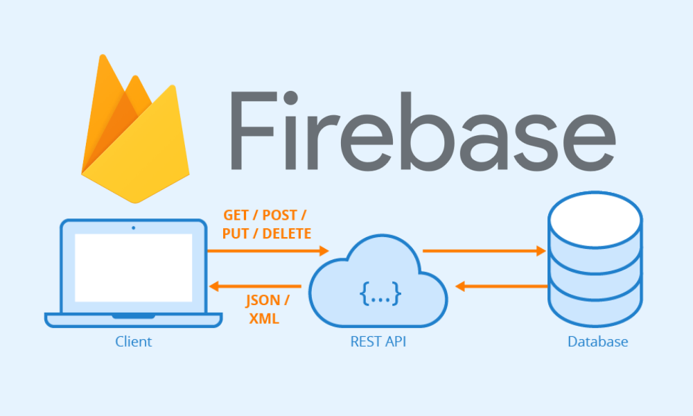

# React-form-Firebase

### How to make a form in react with a Firebase backend?

#### Step 1: First make a components folder and make:
- Header
- registrationForm (useState to handle the form, and use e handleclick value event)
- Style your registration Form 

#### Step 2: Let get started with Firebase:
- Make a new account on Firebase and make a new project registrationForm
- Let's create a new database and choose the test environmentµ
- Now start a real-time database and give it a name.
- Go to your project Overview and start <> 
- Add Firebase to your web app by registering it
- npm install firebase in your project and add a firebase.js file with all the information from the register
- import { getDatabase } from "firebase/database" and export const database = getDatabase(app);
- Now in your registrationForm import {database} from '../firebase' and import {ref,push,child,update} from "firebase/database";
- At last, we can make Post request to the database.

#### What did I learn with this Exercise:
- I've learned how Firebase works and how we can actually make a real-time database and connect to it. 
- We can make POST requests to the database when the user fills in the form
- My next thing will be to make a CRUD with React + Firebase || Node.js / Express.
